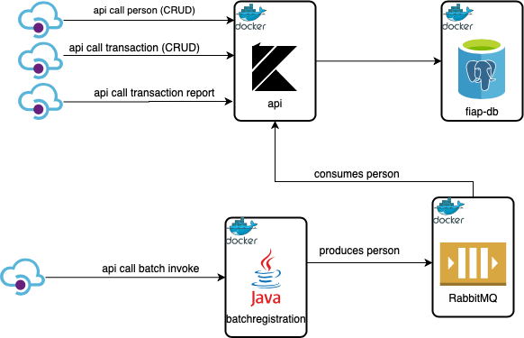
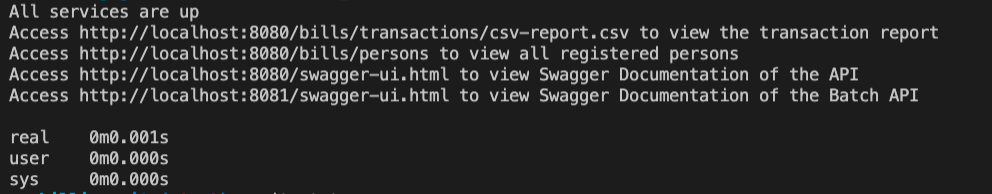
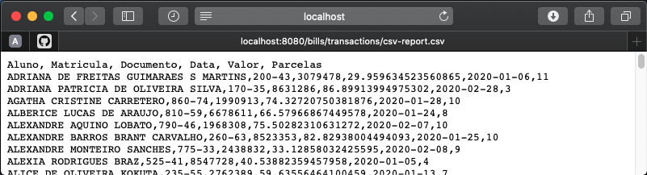

# Trabalho de Conclusão Fiap - Spring

### Introdução
Este trabalho consiste no desenvolvimento de um sistema para o controle de transações de cartão de crédito realizados pelos alunos da Fiap.

#### Cluster RabbitMQ
A pasta rabbit-cluster contém apenas os arquivos necessários para criar um container Docker com um servidor RabbitMQ.

#### Batch Registration
A pasta batchregistration contém a aplicação para importar os alunos a serem cadastrados previamente.
Este componente foi desenvolvido utilizando a linguagem Java e os frameworks Spring Boot, Spring Batch e Spring Cloud Stream.
O job responsável por importar os alunos pode ser invocado pelo endpoint http://localhost:8081/jobs/persons/invoke.
Ao invocar o endpoint, o processo batch inicializa, lendo os alunos no arquivo data/lista_alunos.txt e publicando-os no brocker RabbitMQ.


#### API
A pasta API contém a aplicação pra cadastrar alunos e transações de cartão de crédito.
Este componente foi desenvolvido utilizando Kotlin e os frameworks Spring Boot e Spring Cloud Stream.
Além disso, aplicação está conectada ao RabbitMQ para cadastrar os alunos recebidos por meio de eventos.
Todos os endpoints para cadastrar os alunos e as transações estão disponíveis neste componente.

### Arquitetura da solução



### Execução do ambiente
Para facilitar o provisionamento do ambiente, foi criado um arquivo bash que inicializa todos os containers e faz a chamada para os endpoints para cadastrar os alunos e gerar uma massa simulada de transações.
Basta navegar até a pasta do projeto e executar o comando:
```bash run_all.sh```

E aguardar o provisionamento do ambiente.



Ps: se preferir, basta entrar em cada uma das pastas (api, batchregistrsation e rabbit-cluser) e executar o comando:
```bash run.sh```

Após o término do provisionamento, ao acessar o endpoint http://localhost:8080/bills/transactions/csv-report.csv, as transações simuladas podem ser acessadas:



### Swagger
Para acessar o Swagger dos componentes, acessar os links:
- http://localhost:8080/swagger-ui.html (API)
- http://localhost:8081/swagger-ui.html (batchregistration)


### Tecnologias utlizadas
- Java
- Kotlin
- Spring
- Spring Boot
- Spring Batch
- Spring Cloud Stream
- PostgreSQL
- RabbitMQ
- OpenCSV
- Docker


### **Grupo:**

Este Trabalho foi desenvolvido para a matéria de **Spring** do **MBA - Fullstack developer, Microservices, Cloud e IOT**

`Pelos alunos:`

| Nome | RM|
|-------|:---:|
|**Flávio Alves Ferreira da Silva** |`RM: 333565`|
|**Milton Luiz Ribeiro Junior** |`RM: 333949`|
|**Pedro Madi Della Coletta** |`RM: 334109`|
|**Rafael Miranda de Almeida** |`RM: 333829`|
|**Rodrigo de Almeida Pereira** |`RM: 333241`|
|**Wellington Moreira Bastos** |`RM: 333878`|
|||

